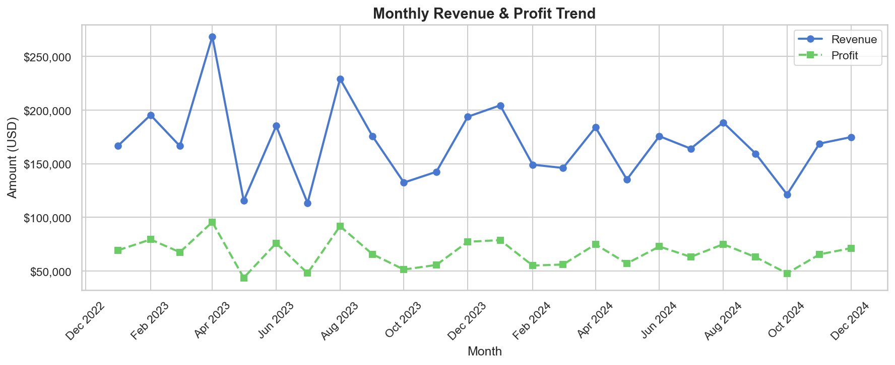

# 📊 Sales & Performance Dashboard

> An end-to-end data analytics project covering **ETL**, **SQL analysis**, **Python EDA**, and **Power BI dashboarding** for sales performance insights.
> **Note:** This project was originally developed in early 2024 
> and uploaded to GitHub in May 2026.
---


## 🗂️ Project Structure

```
sales-performance-dashboard/
│
├── data/
│   ├── sales_data.csv            # Raw generated dataset (2,000 orders)
│   ├── sales_data_clean.csv      # Cleaned & transformed dataset (ETL output)
│   └── charts/                   # EDA chart outputs (PNG)
│
├── sql/
│   └── schema_and_queries.sql    # Star schema DDL + 10 analytical queries + view
│
├── python/
│   ├── generate_data.py          # Dummy dataset generator
│   └── etl_and_eda.py            # ETL pipeline + EDA with 6 visualizations
│
└── README.md
```

---

## 🎯 Business Objective

Analyze 2 years of sales data across **5 regions**, **5 product categories**, and **20 sales reps** to:

- Track **revenue and profit trends** over time
- Identify **top-performing regions, reps, and categories**
- Measure the **impact of discounting** on profit margins
- Automate reporting for **5+ business KPIs**

---

## 🛠️ Tech Stack

| Layer | Tools |
|---|---|
| Data Generation | Python, NumPy, Pandas |
| ETL & EDA | Python, Pandas, Matplotlib, Seaborn |
| Database & SQL | PostgreSQL / MySQL / SQL Server |
| Visualization | Power BI, DAX, Power Query |

---

## 📁 Dataset Overview

The dataset (`sales_data.csv`) contains **2,000 synthetic sales orders** with the following fields:

| Column | Description |
|---|---|
| `order_id` | Unique order identifier |
| `order_date` | Date order was placed (2023–2024) |
| `ship_date` | Date order was shipped |
| `ship_mode` | Shipping method (Standard / Express / Same Day / Economy) |
| `customer_id` | Customer identifier (300 unique customers) |
| `region` | Sales region (North / South / East / West / Central) |
| `sales_rep` | Sales representative (20 reps) |
| `category` | Product category |
| `sub_category` | Product sub-category |
| `unit_price` | Price per unit |
| `quantity` | Units ordered |
| `discount` | Discount applied (0–20%) |
| `sales` | Net revenue after discount |
| `cost` | Cost of goods |
| `profit` | Gross profit |
| `profit_pct` | Profit margin % |

---

## ⚙️ How to Run

### Prerequisites

```bash
pip install pandas numpy matplotlib seaborn
```

### Step 1 — Generate the dataset

```bash
python python/generate_data.py
```

Creates `data/sales_data.csv` with 2,000 rows.

### Step 2 — Run ETL + EDA

```bash
python python/etl_and_eda.py
```

This will:
- Clean and transform the raw data → `data/sales_data_clean.csv`
- Generate **6 EDA charts** saved to `data/charts/`
- Print a **KPI summary** in the terminal

### Step 3 — Run SQL Queries

Load `sql/schema_and_queries.sql` into your preferred SQL client (PostgreSQL, MySQL, or SQL Server) and execute the queries against the dataset.

---

## 📈 EDA Charts

| Chart | Insight |
|---|---|
| `01_monthly_trend.png` | Revenue & profit over 24 months |
| `02_revenue_by_region.png` | Regional revenue comparison |
| `03_profit_margin_subcategory.png` | Margin by product sub-category |
| `04_discount_vs_margin.png` | How discounting erodes margins |
| `05_top_reps.png` | Top 10 reps — revenue vs profit |
| `06_region_quarter_heatmap.png` | Revenue heatmap (region × quarter) |

---

## 🔍 SQL Queries Included

| # | Query |
|---|---|
| 1 | Overall KPI summary (orders, revenue, profit, margin) |
| 2 | Monthly revenue & profit trend |
| 3 | Revenue & profit by region |
| 4 | Category & sub-category performance |
| 5 | Top 10 sales reps |
| 6 | Top 10 customers by lifetime value |
| 7 | Month-over-Month (MoM) growth using LAG() CTE |
| 8 | Discount band impact on profit |
| 9 | Shipping mode performance |
| 10 | Year-over-Year (YoY) comparison |
| VIEW | `vw_sales_report` — unified reporting view |

---

## 📊 Power BI Dashboard

The Power BI dashboard connects to the cleaned dataset and includes:

- **KPI Cards**: Total Revenue, Profit, Orders, Avg Margin
- **Line Chart**: Monthly revenue & profit trend
- **Bar Charts**: Revenue by region, category, and rep
- **Map Visual**: Regional sales distribution
- **Slicers**: Year, Region, Category, Ship Mode
- **DAX Measures**: MoM Growth %, YTD Revenue, Avg Discount Impact

> Power BI `.pbix` file can be connected to `sales_data_clean.csv` or an Azure SQL Database.

---

## 💡 Key Findings

- **Electronics** generates the highest revenue but **Office Supplies** delivers the best profit margins
- Orders with **discounts above 20%** show a significant drop in average margin
- The **North and West regions** consistently outperform others in revenue
- **Express shipping** correlates with higher-value orders

---

## 👤 Author

**Yash Punyarthi**
Data Analyst | Power BI Developer | SQL Analyst

[](https://linkedin.com/in/yashpunyarthi06)
[](mailto:y.punyarthi01@gmail.com)

---

## 📄 License

This project is open-source and available under the [MIT License](LICENSE).
